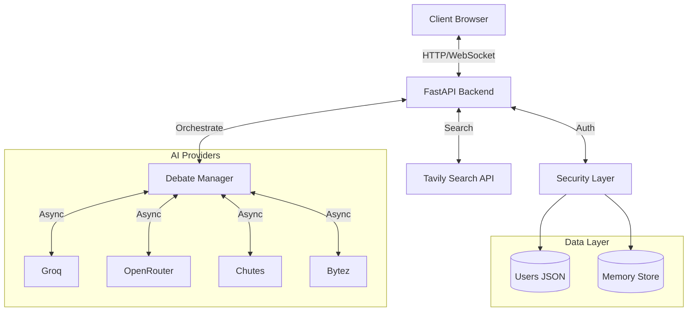

# AI Debate Arena

**Live Demo:** [https://ai-chat-debate-arena.onrender.com](https://ai-chat-debate-arena.onrender.com)

A secure, multi-provider AI debate platform that orchestrates parallel responses from various Large Language Models (LLMs) to provide diverse perspectives on user queries. The system integrates real-time web research to ground AI responses in current data.

## Features

- **Multi-Provider Orchestration**: Parallel execution of multiple AI providers (Groq, OpenRouter, Chutes, Bytez).
- **Web Research Integration**: Automated web search using Tavily API to provide context to LLMs.
- **Answer Synthesis**: Intelligent synthesis of multiple AI responses into a cohesive final answer.
- **Authentication System**: Secure user management with Email/Password and Google OAuth support.
- **Real-time Analytics**: Dashboard for monitoring provider latency, token usage, and system health.
- **Security First**: Implemented with strict CSP, rate limiting, input sanitization, and secure headers.
- **Optimized Performance**: Token usage optimization and concurrent asynchronous processing.

## Technology Stack

- **Backend**: Python 3.11, FastAPI
- **Frontend**: Vanilla HTML5, CSS3, JavaScript (Embedded)
- **Database**: JSON-based flat file storage (Development), In-memory session management
- **AI Integration**: Custom provider adapters, Tavily Search API
- **Live Deployment**: Render.com

## System Architecture

The application uses an asynchronous, event-driven architecture to handle parallel AI interactions efficiently.



### Core Components
1.  **FastAPI Backend**: Handles HTTP requests, authentication, and routing.
2.  **Debate Manager**: Asynchronously dispatches prompts to multiple AI providers and aggregates results.
3.  **Security Layer**: Manages rate limiting, input sanitization, and session validation.
4.  **Frontend**: Lightweight, embedded UI with real-time updates and dynamic visualizations.

## How to Run Locally

Follow these steps to get the project running on your local machine.

### 1. Prerequisites
- Python 3.11 or higher
- Git
- An active internet connection

### 2. Clone the Repository
```bash
git clone https://github.com/sayon999-d/AI-Chat-Debate-Arena.git
cd AI-Chat-Debate-Arena
```

### 3. Environment Setup
Create a virtual environment to isolate dependencies:
```bash
# MacOS/Linux
python -m venv venv
source venv/bin/activate

# Windows
python -m venv venv
venv\Scripts\activate
```

### 4. Install Dependencies
```bash
pip install -r backend/requirements.txt
```

### 5. Configuration
Set up your environment variables:
```bash
# Copy the example file
cp backend/.env.example backend/.env

# Open .env and add your API keys
# nano backend/.env
```
**Required Keys:** `GROQ_API_KEY`, `OPENROUTER_API_KEY`, etc.
**Optional:** `GOOGLE_CLIENT_ID` (for Google Login).

### 6. Run the Application
```bash
cd backend
python main.py
```
The server will start at `http://0.0.0.0:8000`.

### 7. Access the App
Open your browser and navigate to:
**[http://localhost:8000](http://localhost:8000)**

You will be redirected to the login page. You can create a new account or sign in.

## API Documentation

When the server is running, you can access the interactive API documentation (Swagger UI) at `http://localhost:8000/docs` if enabled in configuration.

## Deployment

The application is deployed on Render.com.

**Live URL:** [https://ai-chat-debate-arena.onrender.com](https://ai-chat-debate-arena.onrender.com)

To deploy your own instance:
1. Connect your repository to Render.
2. Configure environment variables in the Render dashboard.
3. Update OAuth redirect URIs to match your domain.

## License

This project is open source and available under the MIT License.